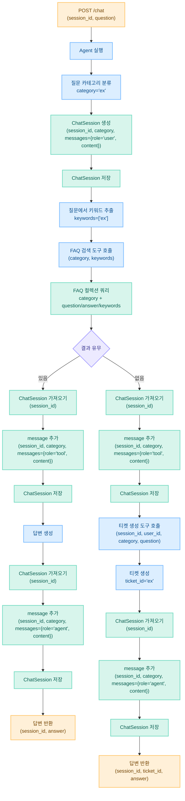

```mermaid
flowchart TD
    %% Legend: API=yellow, Agent=blue, MongoDB=green, Monitoring=gray
    
    0["POST /chat<br/>(session_id, question) "]:::api
    0 --> 10["Agent 실행"]:::agent
    
    10 --> 20["질문 카테고리 분류<br/>category='ex'"]:::agent
    20 --> 22["ChatSession 생성<br/>(session_id, category, messages={role='user', content})"]:::mongodb
    22 --> 23["ChatSession 저장"]:::mongodb
    
    23 --> 25["질문에서 키워드 추출<br/>keywords=['ex']"]:::agent
    25 --> 30["FAQ 검색 도구 호출<br/>(category, keywords)"]:::agent
    30 --> 40["FAQ 컬렉션 쿼리<br/>category + question/answer/keywords"]:::mongodb
    40 --> 50{"결과 유무"}:::branch
    
    50 -->|있음| 60["ChatSession 가져오기<br/>(session_id)"]:::mongodb
    60 --> 65["message 추가<br/>(session_id, category, messages={role='tool', content})"]:::mongodb
    65 --> 70["ChatSession 저장"]:::mongodb
    70 --> 80["답변 생성"]:::agent
    80 --> 90["ChatSession 가져오기<br/>(session_id)"]:::mongodb
    90 --> 100["message 추가<br/>(session_id, category, messages={role='agent', content})"]:::mongodb
    100 --> 110["ChatSession 저장"]:::mongodb
    110 --> 120["답변 반환<br/>(session_id, answer)"]:::api
    
    50 -->|없음| 130["ChatSession 가져오기<br/>(session_id)"]:::mongodb
    130 --> 140["message 추가<br/>(session_id, category, messages={role='tool', content})"]:::mongodb
    140 --> 150["ChatSession 저장"]:::mongodb
    150 --> 160["티켓 생성 도구 호출<br/>(session_id, user_id, category, question)"]:::agent
    160 --> 170["티켓 생성<br/>ticket_id='ex'"]:::agent
    170 --> 180["ChatSession 가져오기<br/>(session_id)"]:::mongodb
    180 --> 190["message 추가<br/>(session_id, category, messages={role='agent', content})"]:::mongodb
    190 --> 200["ChatSession 저장"]:::mongodb
    200 --> 210["답변 반환<br/>(session_id, ticket_id, answer)"]:::api
    
    classDef api fill:#fff0d8,stroke:#ffc76e,color:#7a4500,stroke-width:2px;
    classDef agent fill:#dceeff,stroke:#7bbcff,color:#064b8e,stroke-width:2px;
    classDef mongodb fill:#d8f5ec,stroke:#74dbc2,color:#075f50,stroke-width:2px;
    classDef monitoring fill:#f1f0eb,stroke:#bbb8b0,color:#444,stroke-width:2px;
    classDef branch fill:#eceaff,stroke:#a8a0ff,color:#322f8f,stroke-width:2px;
```